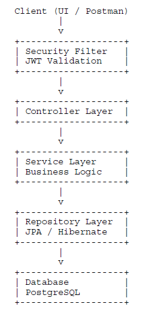

# 🧑‍💻 User Management System – Spring Boot + JWT
> Architected • Secure • Scalable • Interview-Ready Backend Application


## Overview

This project is a **User Management System** built using **Spring Boot** with **JWT-based authentication**.  
It follows **clean layered architecture**, **enterprise best practices**, and **stateless security design**.

This repository can be used as:
- A real-world backend reference project
- A reusable Spring Boot + JWT template
- A strong portfolio project for interviews
- A base for scaling into microservices


## Project Goals

- Implement **secure authentication** using JWT
- Follow **clean layered architecture**
- Enforce **best practices** (DTOs, validation, exception handling)
- Design with **scalability & maintainability** in mind
- Provide **architect-level documentation**

## Architecture Overview

### High-Level Architecture



### Architectural Style
- Layered Architecture
- Stateless REST API
- JWT-based Authentication
- Centralized Exception Handling

## Package Structure

com.hamid.usermanagement
├── controller → REST API endpoints
├── service → Business logic interfaces
├── service.impl → Business logic implementations
├── repository → Database access (JPA)
├── entity → JPA entities
├── dto → Request & response contracts
├── config → Security, JWT, Password configs
├── exception → Custom exceptions & handlers


### Why this structure?
- Clear separation of concerns
- Easy onboarding for new developers
- Industry-standard Spring Boot layout
- Microservice-ready


## Security Architecture (JWT)

### Why JWT?
- Stateless authentication
- No server-side sessions
- Horizontally scalable
- Cloud & microservice friendly

### JWT Authentication Flow

1. User logs in with email & password
2. Credentials validated in Service layer
3. JWT token generated and returned
4. Client sends token in `Authorization` header
5. `JwtAuthenticationFilter` validates token
6. `SecurityContext` is populated
7. Protected APIs are accessed

## Layer-by-Layer Explanation

### 1️⃣ Controller Layer
**Responsibilities**
- Handle HTTP requests & responses
- Apply request validation
- Delegate logic to service layer

**Does NOT**
- Contain business logic
- Access database directly


### 2️⃣ DTO Layer
**Why DTOs**
- Protect database entities
- Define API contracts
- Apply validation rules
- Ensure backward compatibility

**Examples**
- `LoginRequest`
- `RegisterRequest`
- `UpdateUserRequest`
- `AuthResponse`


### 3️⃣ Service Layer
**Responsibilities**
- Core business logic
- User validation
- Password encryption
- JWT generation
- Transaction management

**Why `@Transactional`**
- Ensures atomic operations
- Prevents partial database updates


### 4️⃣ Repository Layer
**Responsibilities**
- Database interaction
- CRUD operations via Spring Data JPA

**Benefits**
- No SQL required
- Cleaner and testable code
- Database-agnostic


### 5️⃣ Security Layer
**Components**
- `SecurityConfig`
- `JwtAuthenticationFilter`
- `JwtUtil`
- `PasswordConfig`

**Key Decisions**
- CSRF disabled (stateless API)
- Form login disabled
- HTTP Basic disabled
- Custom JWT filter integrated


### 6️⃣ Exception Handling Layer
**Why centralized handling**
- Clean controllers
- Consistent error responses
- Correct HTTP status codes
- No stack trace leakage

**Handled Exceptions**
- `UserAlreadyExistsException` → 400 BAD REQUEST
- `UserNotExistException` → 404 NOT FOUND


## API Endpoints

### Authentication APIs
| Method | Endpoint | Description |
|------|---------|-------------|
| POST | `/api/auth/register` | Register new user |
| POST | `/api/auth/login` | Login & get JWT |

### User APIs (Protected)
| Method | Endpoint | Description |
|------|---------|-------------|
| PUT | `/api/users/update/{id}` | Update user |
| DELETE | `/api/users/{id}` | Delete user |


## Authorization Header
Authorization: Bearer <JWT_TOKEN>


## Validation Rules

- Email must be valid
- Password minimum length: 6
- Mandatory fields enforced using Jakarta Validation
- Invalid input returns `400 Bad Request`


## Password Security

- Passwords are never stored in plain text
- BCrypt hashing is used
- Automatic salting
- Resistant to brute-force attacks


## Database

- PostgreSQL
- JPA / Hibernate
- Auto-generated primary keys
- Unique constraint on email

## Configuration

### application.properties
```properties
spring.datasource.url=jdbc:postgresql://localhost:5432/USER MANAGEMENT SYSTEM 
spring.datasource.username=your_username
spring.datasource.password=your_password

spring.jpa.hibernate.ddl-auto=update
spring.jpa.show-sql=true

git clone https://github.com/your-username/user-management-jwt.git
cd user-management-jwt
mvn clean install
mvn spring-boot:run

Application runs at:

http://localhost:8080
